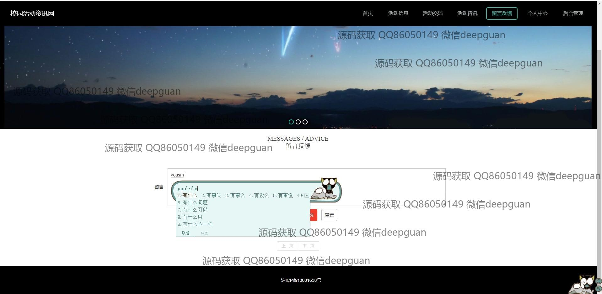

<h1 align="center">校园活动资讯网+vue</h1>

## 简介
校园活动资讯网：包括用户管理、活动信息管理、活动报名、留言反馈等功能模块，支持富文本编辑、图片上传及活动交流，提供简洁明了的后台管理界面以提升用户体验。    --计算机毕业设计源码；毕设源码；java毕业设计源码

## 联系方式

<h3 align="center">获取完整代码与数据库文件 + 微信：deepguan QQ: 86050149 QQ群: 783742310</h3>

<h3 align="center">可帮忙远程部署 包运行成功！提供远程部署、修改代码、设计文档指导、代码讲解等服务！</h3>

## 功能介绍（完整见运行截图）
管理员：支持基本功能如登录、注册、退出操作，管理端提供用户管理、活动信息管理、活动报名管理、留言板管理、轮播图管理等功能模块，支持活动信息的发布、编辑、删除、审核，轮播图的新增、修改，留言回复及管理。个人中心支持修改用户名、密码等信息，整体功能便于高效管理和操作。

用户：提供注册、登录、退出功能，支持通过主导航栏快速浏览首页、活动信息、活动交流等模块。用户可在活动详情页查看活动资讯、参与报名、提交评论和反馈。个人中心支持个人信息管理，包括用户名、密码、头像和联系方式修改，便于用户参与校园活动和信息互动。

访客：无需登录即可浏览网站首页，包括活动信息、活动交流、留言反馈模块。首页提供轮播图展示，活动列表支持按关键字搜索，方便访客快速获取所需资讯。

开发者：基于SSM框架和Vue技术，实现前后端分离，功能模块包括富文本编辑器、图片上传、评论及分页功能，重点提升用户体验和交互效率，后台功能分类明确，便于项目扩展与维护。

## 运行截图

本代码来源于网络,仅供学习参考使用!

